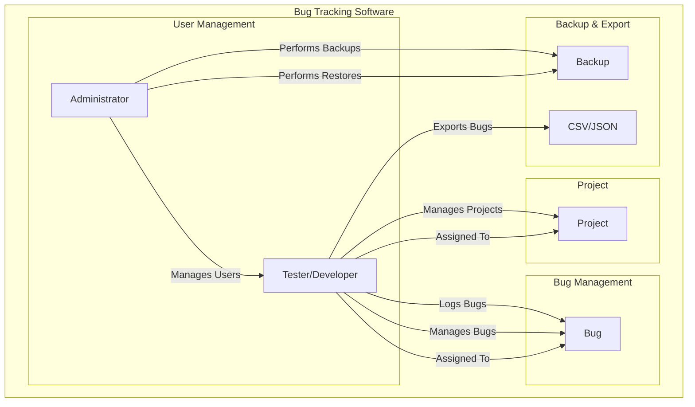

# Ridiculously Simple Bug-Tracking "Pareshaan" Requirements

## Overview

🚀 We aim to create a user-friendly bug-tracking solution tailored for small projects with a focus on simplicity.

### Goals

🎯 **We want to:**
- Be a solution for a small project, which is starting up with a small number of users.
- Take away all bulky details from the bugs, and just stick to the basics.
- Offer a simple text-based bug format, allowing users to write bugs and upload them from anywhere.
- Provide easy backup of all bug data and the ability to bring up another instance with the same data with ease.
- Enable the ability to export bugs to CSV and JSON files.

🙅‍♂️ **We don't want to:**
- Be a solution for medium to large-scale projects.
- Add bulky features like file attachments.
- Support project management.

## Detailed Requirements

### User Roles

- **Administrator**:
    - Can create and manage projects.
    - Can invite users and assign them roles.
    - Can perform backups and restores. 📂

- **Tester/Developer**:
    - Can log bugs.
    - Can view and edit their own bugs.
    - Can view bugs in projects they are assigned to.
    - Can export bugs to CSV and JSON. 🐞

### Bug Logging

- Users can log bugs with the following details:
    - Title
    - Description
    - Steps to reproduce
    - Expected behavior
    - Actual behavior
    - Severity/Priority (e.g., Low, Medium, High)
    - Status (e.g., Open, In Progress, Closed)

### Bug Management

- Users can edit and delete their own bugs.
- Users can assign bugs to specific developers or testers.
- Users can change the status of bugs.
- Users can filter and search for bugs within a project.
- Simple timestamping of bug creation and last modification.

### Project Management

- Create and manage multiple projects.
- Define project details such as name and description.
- Assign users (testers and developers) to specific projects.
- View a list of projects with their associated bugs.

### Backup and Restore

- Ability to backup all bug data regularly.
- Store backups securely and allow easy restoration.
- Provide documentation on how to restore from backups.

### Export and Import

- Export bug data to CSV and JSON files.
- Simple import mechanism to restore bug data from CSV or JSON backups.

### Security and Access Control

- Role-based access control (admin, tester, developer).
- Ensure data security and user authentication.
- Audit trail for bug changes (who made the change and when).

### Notifications

- Send email notifications for bug updates and assignments. 📧

### Usability

- Intuitive and user-friendly interface.
- Support for mobile devices.
- Fast and responsive. 🚀

## Basic structure

