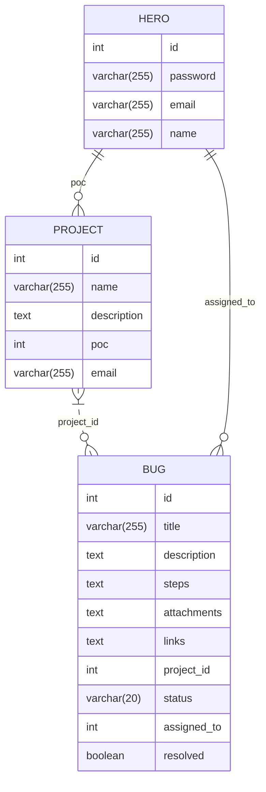

```mermaid
erDiagram
    HERO ||--o{ PROJECT : "poc"
    PROJECT }|..o{ BUG : "project_id"
    HERO ||--o{ BUG : "assigned_to"

    HERO {
        int id
        varchar(255) password
        varchar(255) email
        varchar(255) name
    }

    PROJECT {
        int id
        varchar(255) name
        text description
        int poc
        varchar(255) email
    }

    BUG {
        int id
        varchar(255) title
        text description
        text steps
        text attachments
        text links
        int project_id
        varchar(20) status
        int assigned_to
        boolean resolved
    }
```