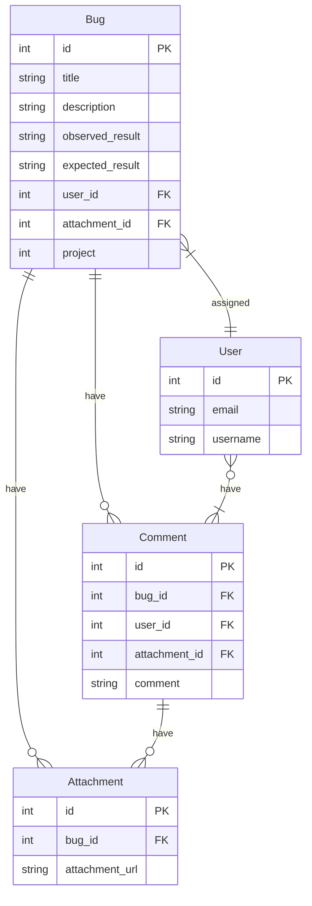

There'll be five key entities of our system,
1. **User**
2. **Bug**
3. **Attachment**
4. **Comment**

Entity Relationship diagram:

Guidelines for future development:
- Always use snake case for naming for any column/table name.